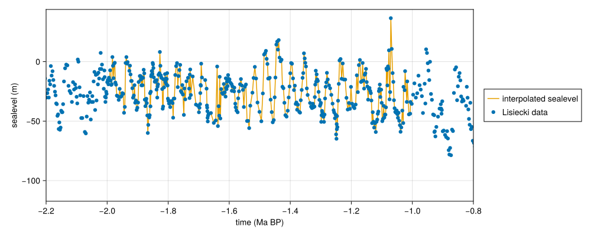
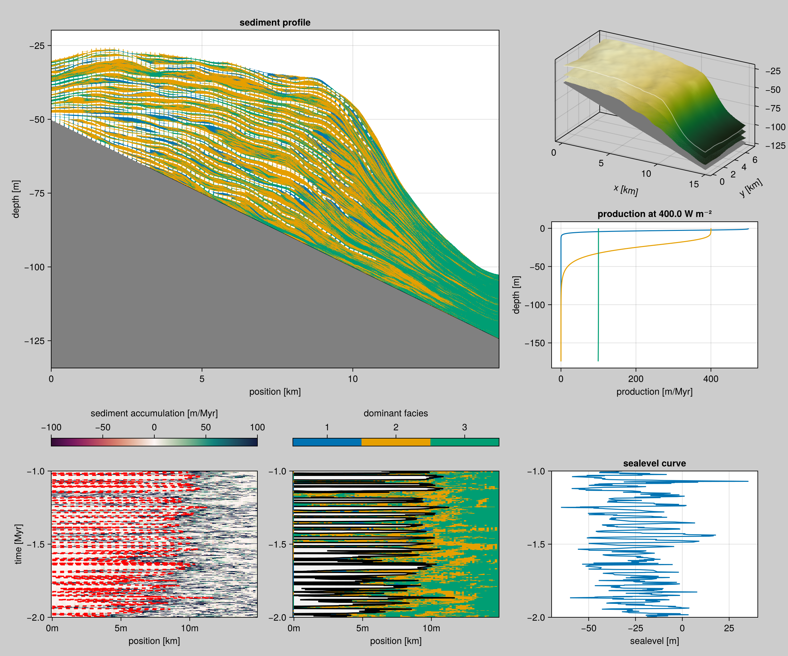

# Tabular sea levels

In CarboKitten, the sea-level curve is given as a function of time. This means you can generate sea levels automatically, or if you like interpolate them on a table. In this demo, we show how we can read values from a file and interpolate those for input into the CarboKitten ALCAP model.

``` {.julia #tabular-sea-level}
using CarboKitten.Components.Common
using CarboKitten.Model.ALCAP2
```

CarboKitten has convenience functions for reading tabular data, both TSV and CSV are supported.

## The data

In this example we load the sea level data compilation from Miller 2020 [Miller2020Data](@cite).


## Loading

For this example we have a tab-separated data file, that is distributed with CarboKitten. However, you can have `filename` point to any tabular data on your filesystem. 

You can use the `readdlm` function in `DelimitedFiles` to read most text based table formats. See the [`DataFrames` documentation](https://dataframes.juliadata.org/stable/man/importing_and_exporting/) to find out how to read from most popular data file formats.

``` {.julia #tabular-sea-level}
function miller_2020()
    dir = artifact_dir()
    filename = joinpath(dir, "Miller2020", "Cenozoic_sea_level_reconstruction.tab")

    data, header = readdlm(filename, '\t', header=true)
    return DataFrame(
        time=-data[:,4] * u"kyr",
        sealevel=data[:,7] * u"m",
        refkey=categorical(data[:,2]),
        reference=categorical(data[:,3]))
end
```

In this example we'll only use the Lisiecky data set.

```@example
using CarboKitten.DataSets: miller_2020
using DataFrames

df = miller_2020()
levels(df.refkey)
```

## Interpolating

There are many ways to interpolate the data we have. We will now stick to the package `Interpolations` and use the linear interpolator in there. 

``` {.julia #tabular-sea-level}
function sea_level()
    df = miller_2020()
    lisiecki_df = df[df.refkey .== "846 Lisiecki", :]
    sort!(lisiecki_df, [:time])

    return linear_interpolation(
        lisiecki_df.time,
        lisiecki_df.sealevel)
end
```

## Inspecting our interval

We will be running a simulation from 2 million years BA, to 1 million years BA with a time step of 200 years.

``` {.julia #tabular-sea-level}
const TIME_PROPERTIES = TimeProperties(
    t0 = -2.0u"Myr", 
    Δt = 200.0u"yr",
    steps = 5000
)
```



## Other parameters
We keep the facies parameters the same as in our other examples. However, because the sea level is fluctuating quite a bit more than in our other examples, we increased the slope two-fold so that the resulting platform fits in our box.

``` {.julia #tabular-sea-level}
const PATH = "data/output"
const TAG = "lisiecki-sea-level"

const FACIES = [
    ALCAP.Facies(
        viability_range=(4, 10),
        activation_range=(6, 10),
        maximum_growth_rate=500u"m/Myr",
        extinction_coefficient=0.8u"m^-1",
        saturation_intensity=60u"W/m^2",
        diffusion_coefficient=10000u"m"),
    ALCAP.Facies(
        viability_range=(4, 10),
        activation_range=(6, 10),
        maximum_growth_rate=400u"m/Myr",
        extinction_coefficient=0.1u"m^-1",
        saturation_intensity=60u"W/m^2",
        diffusion_coefficient=5000u"m"),
    ALCAP.Facies(
        viability_range=(4, 10),
        activation_range=(6, 10),
        maximum_growth_rate=100u"m/Myr",
        extinction_coefficient=0.005u"m^-1",
        saturation_intensity=60u"W/m^2",
        diffusion_coefficient=7000u"m")
]

const INPUT = ALCAP.Input(
    tag="$TAG",
    box=Box{Shelf}(grid_size=(100, 50), phys_scale=150.0u"m"),
    time=TIME_PROPERTIES,
    ca_interval=1,
    bedrock_elevation=(x, y) -> -x / 200.0 - 100.0u"m",
    sea_level=sea_level(),
    subsidence_rate=50.0u"m/Myr",
    disintegration_rate=50.0u"m/Myr",
    insolation=400.0u"W/m^2",
    sediment_buffer_size=50,
    depositional_resolution=0.5u"m",
    facies=FACIES)

function main()
    CarboKitten.init()
    H5Writer.run(Model{ALCAP}, INPUT, "$(PATH)/$(TAG).h5")
end
```



## Running the model

``` {.julia .task file=examples/tabular-sea-level/run.jl}
#| creates: data/output/lisiecki-sea-level.h5

module TabularSeaLevel

using CarboKitten
using CarboKitten.Model: H5Writer, ALCAP2 as ALCAP

using DelimitedFiles: readdlm
using DataFrames
using CarboKitten.DataSets: artifact_dir
using Interpolations
using CategoricalArrays

<<tabular-sea-level>>

end

TabularSeaLevel.main()
```

## Plotting code

``` {.julia .task file=examples/tabular-sea-level/plot.jl}
#| requires: data/output/lisiecki-sea-level.h5
#| creates:
#|      - docs/src/_fig/miller-sea-level.svg
#|      - docs/src/_fig/lisiecki-selection.svg
#|      - docs/src/_fig/lisiecki-sea-level-summary.png
#| collect: figures

module PlotTabularSeaLevel

using CarboKitten.Components.Common
using CarboKitten.DataSets: artifact_dir
using CarboKitten.Components.TimeIntegration: write_times
using CarboKitten.Visualization: summary_plot
using CarboKitten.Model: ALCAP2 as ALCAP
using CarboKitten.Boxes: Box

using DelimitedFiles: readdlm
using CairoMakie
using DataFrames
using Unitful
using Interpolations
using CategoricalArrays

<<tabular-sea-level>>

function plot_miller_data()
    df = miller_2020()
    fig = Figure(size=(1000,300))
    ax = Axis(fig[1, 1]; xlabel="time (Ma BP)", ylabel="sealevel (m)")

    for ref in levels(df.reference)
        subset = df[df.reference .== ref,:]
        lines!(ax, subset.time |> in_units_of(u"Myr"), subset.sealevel |> in_units_of(u"m"), label=ref)
    end
    fig[1, 2] = Legend(fig, ax)

    save("docs/src/_fig/miller-sea-level.svg", fig)
    fig
end

function plot_lisiecki_data()
    df = miller_2020()
    lisiecki_df = df[df.refkey .== "846 Lisiecki", :]
    sort!(lisiecki_df, [:time])

    sl = sea_level()

    fig = Figure(size=(1000, 400))
    ax = Axis(fig[1, 1]; xlabel="time (Ma BP)", ylabel="sealevel (m)", limits=((-2.2, -0.8), nothing))


    times = write_times(TIME_PROPERTIES)
    lines!(ax, times |> in_units_of(u"Myr"), sl.(times) |> in_units_of(u"m"), label="interpolated sealevel", color=Makie.wong_colors()[2])

    scatter!(ax, lisiecki_df.time |> in_units_of(u"Myr"), lisiecki_df.sealevel |> in_units_of(u"m"), label="Lisiecki data")
    fig[1,2] = Legend(fig, ax)

    save("docs/src/_fig/lisiecki-selection.svg", fig)
    fig
end

function plot_result()
    fig = summary_plot("data/output/lisiecki-sea-level.h5")
    save("docs/src/_fig/lisiecki-sea-level-summary.png", fig)
end

end

PlotTabularSeaLevel.plot_miller_data()
PlotTabularSeaLevel.plot_lisiecki_data()
PlotTabularSeaLevel.plot_result()
```
