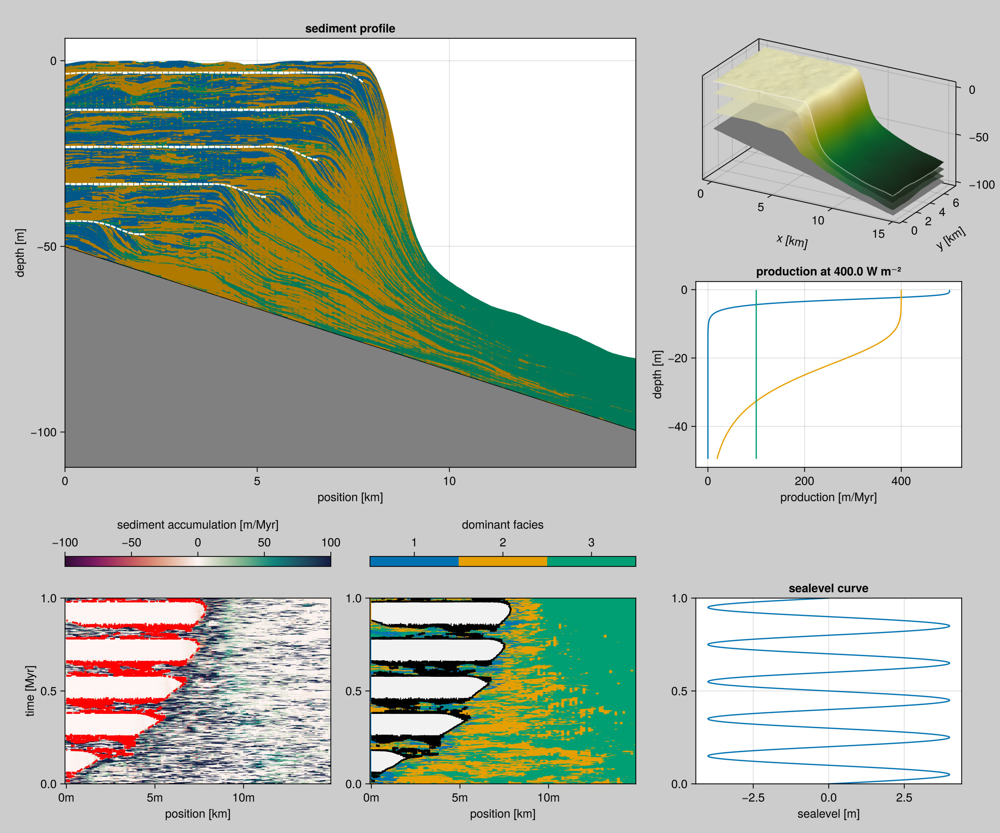

# Model with CA, Production and Active Layer transport (ALCAPS)

The following **S**edimentation model includes the Burgess 2013 **C**ellular **A**utomaton, Bosscher & Schlager 1992 **P**roduction curves and an **A**ctive **L**ayer transport model, based on Paola 1992, henceforth ALCAPS.


```@raw html
<details><summary>Default ALCAPS code</summary>
```

``` {.julia .task file=examples/alcaps/defaults.jl}
#| requires: src/Model/ALCAPS.jl
#| creates: data/alcaps_default.h5

using CarboKitten.Model.ALCAPS

ALCAPS.main(ALCAPS.Input(), "data/alcaps_default.h5")
```

``` {.julia .task file=examples/alcaps/plot-defaults.jl}
#| requires: ext/VisualizationExt.jl data/alcaps_default.h5
#| creates: docs/src/_fig/alcaps_default_profile.png
#| collect: figures

using CairoMakie
using Statistics
using GeometryBasics
using CarboKitten.Visualization

function main()
  fig = Visualization.sediment_profile("data/alcaps_default.h5", 25)
  save("docs/src/_fig/alcaps_default_profile.png", fig)
end

main()
```

```@raw html
</details>
```

## Example Input

The following is a complete example input.

``` {.julia .task file=examples/alcaps/alternative.jl}
#| requires: src/Model/ALCAPS.jl
#| creates: data/alcaps2.h5

using Unitful
using CarboKitten.BoundaryTrait: Shelf
using CarboKitten.Config: Box, TimeProperties
using CarboKitten.Model.ALCAPS: Facies, Input, main
using CarboKitten.Export: data_export, CSV

const m = u"m"
const Myr = u"Myr"

const PATH = "data"
const TAG = "alcaps2"

const FACIES = [
    Facies(viability_range=(4, 10),
        activation_range=(6, 10),
        maximum_growth_rate=500u"m/Myr",
        extinction_coefficient=0.8u"m^-1",
        saturation_intensity=60u"W/m^2",
        diffusion_coefficient=10000u"m"),
    Facies(viability_range=(4, 10),
        activation_range=(6, 10),
        maximum_growth_rate=400u"m/Myr",
        extinction_coefficient=0.1u"m^-1",
        saturation_intensity=60u"W/m^2",
        diffusion_coefficient=5000u"m"),
    Facies(viability_range=(4, 10),
        activation_range=(6, 10),
        maximum_growth_rate=100u"m/Myr",
        extinction_coefficient=0.005u"m^-1",
        saturation_intensity=60u"W/m^2",
        diffusion_coefficient=7000u"m")
]

const PERIOD = 0.2Myr
const AMPLITUDE = 4.0m

const INPUT = Input(
    tag="ALCAPS alternative",
    box=Box{Shelf}(grid_size=(100, 50), phys_scale=150.0m),
    time=TimeProperties(
        Δt=0.0002Myr,
        steps=5000,
        write_interval=1),
    ca_interval=1, bedrock_elevation=(x, y) -> -x / 300.0,
    sea_level=t -> AMPLITUDE * sin(2π * t / PERIOD),
    subsidence_rate=50.0m / Myr,
    disintegration_rate=500.0m / Myr,
    insolation=400.0u"W/m^2",
    sediment_buffer_size=50,
    depositional_resolution=0.5m,
    facies=FACIES)

main(INPUT, "$(PATH)/alcaps2.h5")

data_export(
    CSV(tuple.(10:20:70, 25),
      :sediment_accumulation_curve => "$(PATH)/$(TAG)_sac.csv",
      :age_depth_model => "$(PATH)/$(TAG)_adm.csv",
      :stratigraphic_column => "$(PATH)/$(TAG)_sc.csv",
      :metadata => "$(PATH)/$(TAG).toml"),
    "$(PATH)/alcaps2.h5")
```



```@raw html
<details><summary>Plotting code</summary>
```

``` {.julia .task file=examples/alcaps/plot-alternative.jl}
#| creates: docs/src/_fig/alcaps-alternative.png
#| requires: data/alcaps2.h5
#| collect: figures

using CairoMakie
using Statistics
using GeometryBasics
using CarboKitten.Visualization

function main()
  fig = Visualization.sediment_profile("data/alcaps2.h5", 25)
  save("docs/src/_fig/alcaps-alternative.png", fig)
end

main()
```

```@raw html
</details>
```

## Modular Implementation

``` {.julia file=src/Model/ALCAP2.jl}
# FIXME: rename this to ALCAP and remove old code
@compose module ALCAP2
@mixin Tag, H5Writer, CAProduction, ActiveLayer

using ..Common
using ..CAProduction: production
using ..TimeIntegration
using ..WaterDepth
using ModuleMixins: @for_each

export Input, Facies, run

function initial_state(input::Input)
    ca_state = CellularAutomaton.initial_state(input)
    for _ in 1:20
        CellularAutomaton.stepper(input)(ca_state)
    end

    sediment_height = zeros(Height, input.box.grid_size...)
    sediment_buffer = zeros(Float64, input.sediment_buffer_size, n_facies(input), input.box.grid_size...)

    return State(
        step=0, sediment_height=sediment_height,
        sediment_buffer=sediment_buffer,
        ca=ca_state.ca, ca_priority=ca_state.ca_priority)
end

function step!(input::Input)
    step_ca! = CellularAutomaton.stepper(input)
    disintegrate! = disintegration(input)
    produce = production(input)
    transport = transportation(input)

    function (state::State)
        if mod(state.step, input.ca_interval) == 0
            step_ca!(state)
        end

        p = produce(state)
        d = disintegrate!(state)

        active_layer = p .+ d
        sediment = transport(state, active_layer)

        push_sediment!(state.sediment_buffer, sediment ./ input.depositional_resolution .|> NoUnits) 
        state.sediment_height .+= sum(sediment; dims=1)[1,:,:]
        state.step += 1

        return H5Writer.DataFrame(
            production = p,
            disintegration = d,
            deposition = sediment)
    end
end

function write_header(fid, input::AbstractInput)
    @for_each(P -> P.write_header(fid, input), PARENTS)
end
end
```

## API

```@autodocs
Modules = [CarboKitten.Model.ALCAP2]
```
