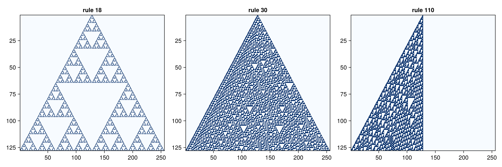
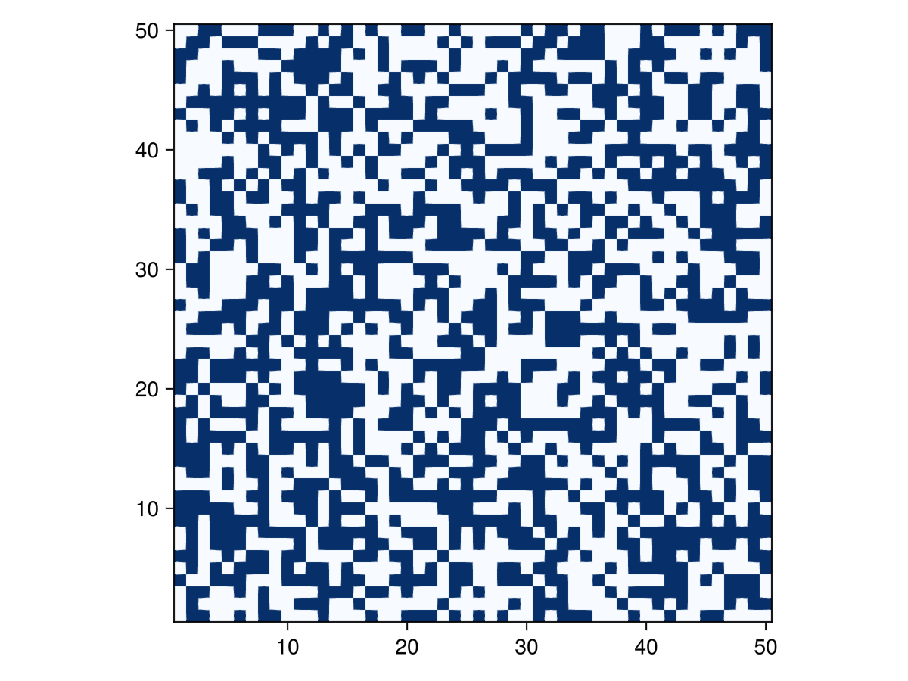
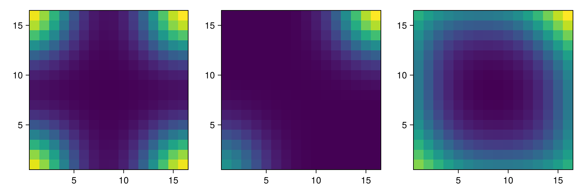

# Stencil operations
A *stencil* is the common term for computing many-to-one operations on grids. Examples of applications are:

- Finite difference schemes
- Finite Impulse Response (FIR) filters
- Convolutions (encompassing the previous two)
- Cellular Automata

Note that for larger convolution kernels, it is often more efficient to perform convolutions in the Fourier domain. On the matter of performance: stencil operations are the textbook example for computations that perform really well on GPUs.

## Boundary types
One thing to be mindful of is the treatment of box boundaries. I define three *traits* here. These are types that are defined with the single goal of using the dispatch mechanism in Julia to  select the right methods for us. Boundaries can be *periodic*, *reflective* or *constant* to some value.

``` {.julia #boundary-types}
abstract type Boundary{dim} end
struct Reflected{dim} <: Boundary{dim} end
struct Periodic{dim} <: Boundary{dim} end
struct Constant{dim,value} <: Boundary{dim} end
```

### Offset indexing
Now we can use these traits to define three methods for indexing on an offset from some index that is assumed to be within bounds.

``` {.julia #spec}
@testset "offset_value" begin
    @test CartesianIndex(1, 1) == offset_index(Reflected{2}, (3, 3), CartesianIndex(1, 1), CartesianIndex(0, 0))
end
```

``` {.julia #offset-indexing}
function offset_index(::Type{Periodic{dim}}, shape::NTuple{dim,Int}, i::CartesianIndex, Δi::CartesianIndex) where {dim}
    CartesianIndex(mod1.(Tuple(i + Δi), shape)...)
end

function offset_index(::Type{Reflected{dim}}, shape::NTuple{dim,Int}, i::CartesianIndex, Δi::CartesianIndex) where {dim}
    clip(i, a, b) = (i < a ? a + a - i : (i > b ? b + b - i : i))
    CartesianIndex(clip.(Tuple(i + Δi), ones(Int, dim), shape)...)
end

function offset_index(::Type{Constant{dim,value}}, shape::NTuple{dim,Int}, i::CartesianIndex, Δi::CartesianIndex) where {dim,value}
    j = i + Δi
    all(checkindex.(Bool, range.(1, shape), Tuple(j))) ? j : nothing
end

function offset_value(BT::Type{B}, z::AbstractArray, i::CartesianIndex, Δi::CartesianIndex) where {dim,B<:Boundary{dim}}
    z[offset_index(BT, size(z), i, Δi)]
end

function offset_value(::Type{Constant{dim,value}}, z::AbstractArray, i::CartesianIndex, Δi::CartesianIndex) where {dim,value}
    j = i + Δi
    (checkbounds(Bool, z, j) ? z[j] : value)
end
```

``` {.julia file=src/BoundaryTrait.jl}
module BoundaryTrait

export Boundary, Reflected, Periodic, Constant, offset_index, offset_value

<<boundary-types>>
<<offset-indexing>>

end
```

### Shelf boundary
The `Shelf` boundary type is specially designed for the simulation of a transect perpendicular to the coast direction. We are periodic in the y-direction and have a Neumannesque constant boundary at the edges of the simulation area.

``` {.julia #boundary-types}
struct Shelf <: Boundary{2} end
```

``` {.julia #offset-indexing}
function offset_index(::Type{Shelf}, shape::NTuple{2,Int}, i::CartesianIndex, Δi::CartesianIndex)
    j = i + Δi
    j[1] >= 1 | j[1] <= shape[1] ? CartesianIndex(j[1], mod1(j[2], shape[2])) : nothing
end

function offset_value(::Type{Constant{dim,value}}, z::AbstractArray, i::CartesianIndex, Δi::CartesianIndex) where {dim,value}
    j = i + Δi
    if j[1] < 1
        return z[1, mod1(j[2], shape[2])]
    elseif j[1] > shape[1]
        return z[shape[1], mod1(j[2], shape[2])]
    else
        return z[j[1], mod1(j[2], shape[2])]
    end
end
```

## Implementation
Using these helper functions we can now define a *stencil* operation. Given the boundary trait, a stencil size and a response function, we can transform an array to a next generation.

``` {.julia #stencil-operation}
function stencil(::Type{T}, ::Type{BT}, n::NTuple{dim,Int}, f::Function) where {T,dim,BT<:Boundary{dim}}
    return stencil(T, T, BT, n, f)
end

function stencil(::Type{In}, ::Type{Out}, ::Type{BT}, n::NTuple{dim,Int}, f::Function) where {In,Out,dim,BT<:Boundary{dim}}
    m = n .÷ 2
    stencil_shape = range.(.-m, m)
    stencil = zeros(In, n)

    function (z_in::AbstractArray{In,dim}, z_out::AbstractArray{Out,dim}, args...)
        @assert (size(z_in) == size(z_out)) "sizes of arrays need to be equal"
        shape = size(z_in)
        for i in CartesianIndices(shape)
            for (k, Δi) in enumerate(CartesianIndices(stencil_shape))
                stencil[k] = offset_value(BT, z_in, i, Δi)
            end
            z_out[i] = f(stencil, args...)
        end
    end
end

function convolution(::Type{B}, kernel::Array{T,dim}) where {dim,T,B<:Boundary{dim}}
    stencil(T, B, size(kernel), s -> sum(s .* kernel))
end
```

More efficient implementations are imaginable. For instance we could use normal unchecked indexing for most of the array, and only use the `offset_value` function when we really need it. Another optimisation could be to generate parts of the inner loop, and/or do the outer loop in parallel.

We will now test this function first on an Elementary CA (ECA), Conway's Game of Life, and a convolution.

```@raw html
<details><summary>Stencil module</summary>
```

``` {.julia file=src/Stencil.jl}
module Stencil

using ..BoundaryTrait
export stencil, convolution

<<stencil-operation>>

end
```

```@raw html
</details>
```

## Examples
### Elementary Cellular Automata
An Elementary Cellular Automata is a one-dimensional CA with two states. Every next generation depends on the direct neighbourhood of three cells. Since there are $2^3 = 8$ patterns and two outcomes for every pattern, there are $2^8 = 256$ possible ECA.

The `rule` function creates the stencil rule from a given integer:

``` {.julia #eca-rule}
rule(i::Int) = function (foo::AbstractVector{T}) where T <: Integer
    d = foo[1]*4 + foo[2]*2 + foo[3]
    i & (1 << d) == 0 ? 0 : 1
end
```

The rest of the script is boring

``` {.julia .build target=docs/src/fig/eca.png}
using CarboKitten.Stencil
using GLMakie

<<eca-rule>>

function eca(r::Int, n::Int, iter::Int)
    y = Array{Int}(undef, n, iter)
    y[:, 1] = zeros(Int, n)
    y[div(n, 2), 1] = 1
    stencil_op = stencil(Int, Periodic{1}, (3,), rule(r))
    for i in 2:iter
        stencil_op(view(y, :, i-1), view(y, :, i))
    end
    y
end

fig = Figure(resolution=(1200,400))
for (idx, r) in enumerate([18, 30, 110])
    ax = Axis(fig[1,idx]; title="rule $(r)", yreversed=true, limits=((1, 256), (1, 128)))
    heatmap!(ax, eca(r, 256, 128); colormap=:Blues)
end
save("docs/src/fig/eca.png", fig)
```



Even these one-dimensional CA show highly complex behaviour. For instance, it has been shown that rule 110 is Turing complete.

### Game of Life
Perhaps the most famous CA is Conway's Game of Life. This is a two-dimensional two-state (dead/alive) CA, with the following rules: a cell is alive in the next generation if it is alive and has two neighbours or if it has three neighbours; in all other cases the cell is dead.

``` {.julia .build target=docs/src/fig/life.gif}
using CarboKitten.Stencil
using GLMakie
using .Iterators: take

"x is a 3x3 region around the cell at x[2,2]."
rules(x) = let c = x[2, 2], s = sum(x) - c
    c && s == 2 || s == 3
end

function game_of_life(w, h)
    y1 = rand(Bool, (w, h))
    y2 = Array{Bool}(undef, w, h)

    op = stencil(Bool, Periodic{2}, (3, 3), rules)
    Channel() do ch
        put!(ch, y1)
        while true
            op(y1, y2)
            (y1, y2) = (y2, y1)
            put!(ch, y1)
        end
    end
end

life = take(game_of_life(50, 50), 150)
fig = Figure()
ax = Axis(fig[1,1], aspect=1)
record(fig, "docs/src/fig/life.gif", life; framerate=10) do frame
    heatmap!(ax, frame; colormap=:Blues)
end
```



### Testing boundaries with a convolution
To test the different boundary types, lets try the following setup. We take a 16x16 image with all zeros except the bottom left gets a value of 1 and the top right pixel gets a value of 2. Now convolve with a Gaussian and see what happens. For the constant boundary, I've set the value to 0.1, to see the effect.



Notice, that for the periodic boundaries, the bottom left and top right are neighbouring. So there the two pixels appear as a single peak. In the reflected case we see a clear distinction between the two corners.

``` {.julia .build target=docs/src/fig/boundary_types.png}
module Script

using CarboKitten.Stencil
using GLMakie

function plot_boundary_types()
    n = 16
    y0 = zeros(Float64, n, n)
    y0[1, 1] = 1
    y0[n, n] = 2
    x = collect(-2:0.25:2)
    k = exp.(-(x.^2 .+ x'.^2))
    k ./= sum(k)

    y_periodic = Array{Float64}(undef, n, n)
    convolution(Periodic{2}, k)(y0, y_periodic)
    y_reflected = Array{Float64}(undef, n, n)
    convolution(Reflected{2}, k)(y0, y_reflected)
    y_constant = Array{Float64}(undef, n, n)
    convolution(Constant{2, 0.1}, k)(y0, y_constant)

    fig = Figure(resolution=(900, 300))
    for (i, y) in enumerate([y_periodic, y_reflected, y_constant])
        ax = Axis(fig[1,i]; aspect=1)
        heatmap!(ax, y; colormap=:viridis)
    end
    save("docs/src/fig/boundary_types.png", fig)
end
end 

Script.plot_boundary_types()
```
